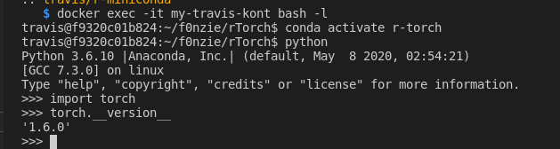

These are some instructions to build and run a Travis machine locally.
We attempt to run all the tests usually run at http://travis-ci.org in a Docker container maintaining the same characteristics of a Travis remote machine.


## Motivation

The goal is reducing the time that takes debugging an error in Anaconda environments when installing PyTorch or rTorch. The bugs remain hidden in the local development machine and only pop up in a Travis machine. That prevent us to complete the tests as the Travis tests can never be completed. There is always doubts of what bug is causing the problem.


## Steps

There are some basic steps to reproduce a Travis remote machine and turn it into a local Docker container. First is identifying from our current Travis machine what is the Dockerhub instance that we should serve as a base of the local Travis machine. Second, we start writing a Dockerfile where the first line is downloading the remote image. Third, we add the locale, language, environment variables, and other settings. Fourth, we install the Linux dependencies, 


## Build Docker image

```
docker build -t my-travis .
```


## Run container with travis

```
docker run --rm --name my-travis-kont -dit my-travis /sbin/init
docker exec -it my-travis-kont bash -l
```


## Run PyTorch from inside the container

### Get the PyTorch version




## Tips 

### Get the PyTorch version from the Dockerfile

```
RUN R -e 'Sys.getenv("PYTORCH_VERSION")'
```

### Set the PyTorch version in a R command from the Dockerfile

```dockerfile
ENV PYTORCH_VERSION="1.1"


RUN R -e 'rTorch:::install_conda(\
    package=paste0("pytorch=", Sys.getenv("PYTORCH_VERSION")), \
    envname="r-torch", conda="auto", \
    conda_python_version="3.6", \
    pip=FALSE, channel="pytorch", \
    extra_packages=c("torchvision", "cpuonly", "matplotlib", "pandas")\
    )'
```


### Set the Python version in a R command from the Dockerfile

To get the environment in R value we use `Sys.getenv("PYTHON_VERSION")`.

```
ENV PYTHON_VERSION="3.6"


RUN R -e 'rTorch:::install_conda(\
    package=paste0("pytorch=", Sys.getenv("PYTORCH_VERSION")), \
    envname="r-torch", conda="auto", \
    conda_python_version=Sys.getenv("PYTHON_VERSION"), \
    pip=FALSE, channel="pytorch", \
    extra_packages=c("torchvision", "cpuonly", "matplotlib", "pandas")\
    )'
```

